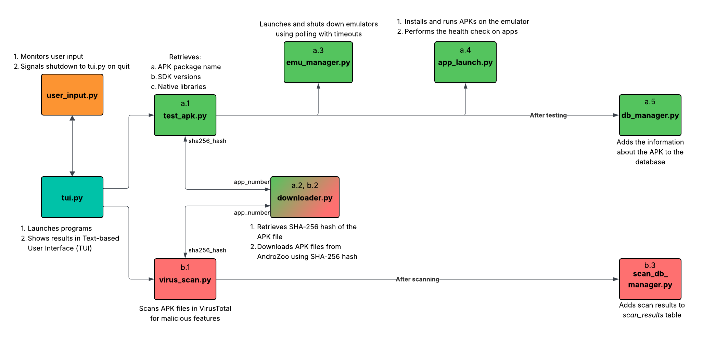

# Introduction
This project aims to automate the process of downloading APKs using AndroZoo API, downloading, installing, and executing them on an Android emulator.
The program also performs a health check, scans files for malicious features on VirusTotal, and stores the results in a database.
Current status and the statistics of the program are shown in a TUI (Text-based User Interface).

# Commands
- Execution: `make run`
- Cleaning generated files: `make clean`
- View the database using SQLite Browser: `make db`

# Files
There are 10 python files.

- **config.py**: Extracts global variables such as *adb*, *aapt*, and *emulator* paths from `config.ini`.

- **test_apk.py:** The entry point of the program. It downloads an APK file using `downloader.py`, launches emulator with `emu_manager.py`, runs the `app_launch.py` to verify the app on the emulator, and updates the database with `db_manager.py` for every downloaded APK.
- **downloader.py**: Downloads APK files from Androzoo using the SHA-256 hash from `latest.csv`.
- **emu_manager.py:** Launches or shuts down emulators based on app's target SDK version.
- **app_launch.py:** Installs and runs the APK on the emulator. Then, it performs the health check on the app.
- **db_manager.py:** Adds the information about the APK to the database.

- **virus_scan.py:** Scans APK files for malicious activity on the VirusTotal website using API.
- **scan_db_manager.py:** Adds scan results to the *scan_results* of the database.

- **tui.py:** Text-based User Interface manager.
- **update_stats.py:** Updates stats for TUI.

# Program Flow Diagram
