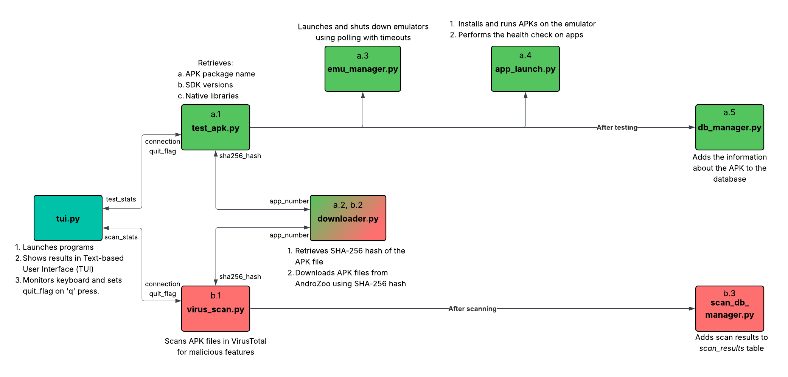

# Introduction
This program aims to automate the process of testing and scanning APKs. It consists of two subprograms:
- **APK Tester**: Downloads APK files using AndroZoo API, installs, and executes them on an Android emulator. It also performs a health check on installed apps.
- **Virus Scanner**: Scans files for malicious features using VirusTotal API.

Current status and the statistics of the program are shown in a TUI (Text-based User Interface). In addition, results are stored in a database.

# Prerequisites
1. Android Studio must be installed on the computer.
2. 12 Android Virtual Devices must be installed with the following Android versions: *4.4, 5.1, 6.0, 7.1.1, 8.1, 9.0, 10.0, 11.0, 12L, 13.0, 14.0, 15.0*
3. SSH key must be created under the name **ssh_key** and stored in **.ssh** directory. It's used to connect to the server to use Androzoo API.
4. SQLite Browser must be installed on the computer (optional, to view the database).

### Execution
1. Add the SSH key to the agent using `make ssh`. It reads the file **./ssh_key** located at the **.ssh** directory.
2. Launch the script using `make run`. TUI will display the statistics of each program.

# Commands
- Adding SSH key (for current session): `make ssh`
- Execution: `make run`
- Cleaning generated files: `make clean`
- Viewing the database using SQLite Browser: `make db`

# Files
There are 9 python files:
- **tui.py:** Entry point of the program. It launches **APK Tester** and **Virus Scanner** and shows their current status as well as their statistics in a TUI (Text-based User Interface).   It also listens to keyboard inputs. When the user presses 'q' key, it updates the global *quit_flag* and processes terminate their work early. When terminated early, their stats are saved in a file. This allows the processes to resume from where they stopped during the next launch.
 
 
- **test_apk.py:** Downloads APK files, launches emulator, runs and verifies the app on the emulator, and updates the database for every downloaded APK.
- **downloader.py**: Downloads APK files from Androzoo using the SHA-256 hash from `latest.csv`.
- **emu_manager.py:** Launches or shuts down emulators based on app's target SDK version.
- **app_launch.py:** Installs and runs the APK on the emulator. Then, it performs the health check on the app.
- **db_manager.py:** Adds the information about the APK to the database. In addition, information about scan results are retrieved from another table.
 
 
- **virus_scan.py:** Downloads APK files and scans them for malicious activity on the *VirusTotal* website using their API.
- **scan_db_manager.py:** Adds scan results to the database.
 
 
- **config.py**: Extracts global variables and configuration variables from `config.ini`.

Consult the **Program Flow Diagram** section to better understand how the program flow goes through the files.

# Program Flow Diagram
